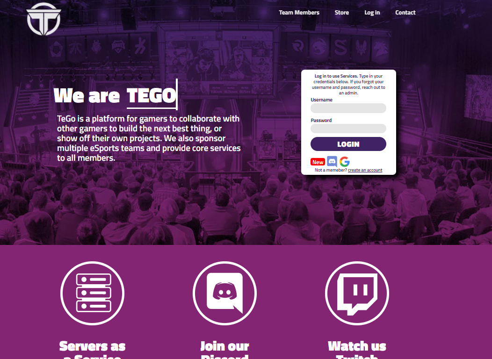
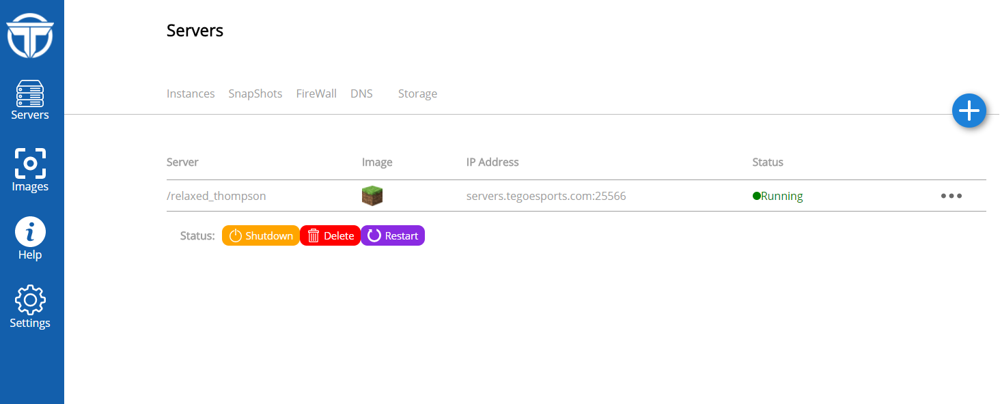

# TegoEsports.com (Closed Beta)

TeGo Esports is an up and coming eSports organization, merging our passion for gaming and technology. Our site offers many features including fast bi-directional communication with socket.io, Discord integration using the Discord API, and a private video game hosting platform with Docker. Not to mention streaming tools, sound and stat bots, and the Official TeGo discord bot that helps you choice the best game to play and organize gaming events  

## Getting Started

We are currently in a closed beta and tegoesports.com takes you to our landing page. If you would like to enroll in the closed beta, please contact me (Brian) at baanstet@oakland.edu to get credentials to dev.tegoesports.com.

### Prerequisites

tegoesports.com is built on the mean stack and requires node.js 6+. 

### Installing

Clone and run

```
npm install
npm start
```


## Demo


[youtube link](https://www.youtube.com/watch?v=YZC4iHVmVuQ)

## Authors

* **Brian Anstett** - *Main Developer* - [github](https://github.com/briananstett)


## License

This project is licensed under the MIT License - see the [LICENSE.md](LICENSE.md) file for details
